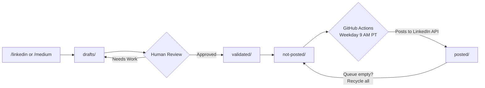
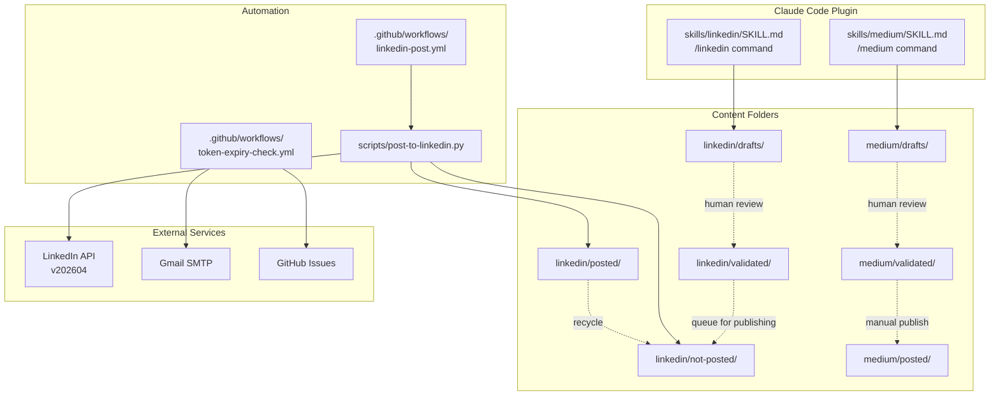

# agentic-writer

A Claude Code plugin that generates LinkedIn posts and Medium articles for technical professionals, with a Git-based content lifecycle and automated publishing via GitHub Actions.


## Overview

agentic-writer adds two slash commands to Claude Code: `/linkedin` and `/medium`. Each command generates a publication-ready draft following a strict writing style (no emojis, no banned words, active voice, spartan tone) and saves it to a Git-tracked content folder. A GitHub Actions workflow posts LinkedIn content on a weekday schedule, moves published files to an archive, and recycles them when the queue runs out.

## Features

- `/linkedin` slash command generates essay-style LinkedIn posts (1,000-1,300 characters optimal) with hook, lessons learned, trade-offs, and CTA sections
- `/medium` slash command generates SEO-optimized Medium articles (1,600-2,000 words) with YAML frontmatter, H2/H3 structure, and 5 suggested tags
- 127 banned words enforced at generation time across both platforms
- No emojis, hashtags, semicolons, or em dashes in any output
- Git-based content lifecycle: drafts, validated, not-posted, posted
- Automated LinkedIn publishing on weekdays at 9 AM PT via GitHub Actions
- Post recycling: when the queue empties, posted files rotate back for reuse
- Weekly token expiry monitoring with email and GitHub Issue alerts
- Zero external Python dependencies (standard library only)
- Installable as a Claude Code plugin with one command

## Content Lifecycle



For Medium articles, the lifecycle ends at `validated/` since publishing to Medium is manual. The author personalizes the draft, adds images, and publishes directly on the platform.

## Architecture



## Quick Start

Install the plugin in Claude Code:

```
claude plugins install github:thomas-to-bcheme/agentic-writer
```

Generate your first LinkedIn post:

```
/linkedin Built a CI/CD pipeline for content automation using Claude Code plugins
```

Generate your first Medium article:

```
/medium Reducing LLM inference costs with post-training quantization
```

Both commands save drafts to their respective `drafts/` folders for human review before publishing.

## Setup

### Prerequisites

| Requirement | Purpose |
|---|---|
| Claude Code | Runtime for the plugin and slash commands |
| Python 3.x | Runs the LinkedIn posting script (standard library only) |
| GitHub account | Repository hosting, Actions for automation, Secrets for credentials |
| LinkedIn Developer account | OAuth app for API access |
| Gmail with 2FA enabled | Token expiry email notifications |

### GitHub Secrets

Configure these in your repository under **Settings > Secrets and variables > Actions**:

| Secret | Value | Notes |
|---|---|---|
| `LINKEDIN_ACCESS_TOKEN` | OAuth2 bearer token | Expires every 60 days |
| `LINKEDIN_PERSON_URN` | `urn:li:person:{id}` | Your LinkedIn author identifier |
| `GMAIL_ADDRESS` | Your Gmail address | Used as both sender and recipient |
| `GMAIL_APP_PASSWORD` | 16-character app password | Requires Gmail 2FA enabled |

### LinkedIn API Setup

1. Create a LinkedIn Developer App at https://www.linkedin.com/developers with the `w_member_social` permission scope
2. Go to the OAuth Token Generator at https://www.linkedin.com/developers/tools/oauth/token-generator
3. Select your app and check `w_member_social`, `openid`, `profile`
4. Click "Request access token" and copy the token
5. Obtain your Person URN:
   ```bash
   curl -s 'https://api.linkedin.com/v2/userinfo' \
     -H 'Authorization: Bearer {TOKEN}' | jq '.sub'
   ```
   Then construct: `urn:li:person:{sub_value}`
6. Add both values as GitHub Secrets
7. Set `.github/linkedin-token-issued.txt` to today's date in YYYY-MM-DD format and push

### Gmail Notifications Setup

1. Enable 2-Step Verification at https://myaccount.google.com/security
2. Generate an App Password at https://myaccount.google.com/apppasswords (name it "LinkedIn Token Check")
3. Copy the 16-character password and add it as the `GMAIL_APP_PASSWORD` secret
4. Add your Gmail address as the `GMAIL_ADDRESS` secret

## Usage

### Generating Content

Run either slash command with a topic or project description:

```
/linkedin Lessons learned building multi-agent orchestration with Claude Code
```

```
/medium How we reduced LLM inference costs 74% with INT8 quantization
```

The generated draft is saved to `linkedin/drafts/` or `medium/drafts/` for review.

### Script Modes

The posting script (`scripts/post-to-linkedin.py`) supports three modes:

| Mode | Command | Behavior |
|---|---|---|
| Preview | `python3 scripts/post-to-linkedin.py --preview` | Prints the API payload. No API call, no credentials needed |
| Dry Run | `DRY_RUN=true python3 scripts/post-to-linkedin.py` | Posts with CONNECTIONS visibility only. Files are not moved |
| Production | `python3 scripts/post-to-linkedin.py` | Posts with PUBLIC visibility. Moves file to `posted/` |

### Manual Workflow Dispatch

Trigger a post manually from the GitHub Actions tab:

1. Go to **Actions > Post to LinkedIn > Run workflow**
2. Select `dry_run: true` for a test post visible only to connections, or `false` for public

## Configuration

### Environment Variables

| Variable | Required | Default | Description |
|---|---|---|---|
| `LINKEDIN_ACCESS_TOKEN` | Yes (except `--preview`) | -- | OAuth2 bearer token for the LinkedIn API |
| `LINKEDIN_PERSON_URN` | Yes (except `--preview`) | -- | `urn:li:person:{id}` author identifier |
| `DRY_RUN` | No | `false` | Set to `true` to post to connections only without moving files |
| `GMAIL_ADDRESS` | For token alerts | -- | Gmail address for expiry notifications |
| `GMAIL_APP_PASSWORD` | For token alerts | -- | Google App Password for SMTP |

### Content Rules

Writing style rules are defined in the skill files and enforced at generation time:

- 127 banned words (e.g., "delve", "game-changer", "utilize", "groundbreaking")
- No emojis, hashtags, semicolons, or em dashes
- Active voice only
- Spartan, conversational tone
- LinkedIn posts: 1,000-1,300 characters optimal, 3,000 max
- Medium articles: 1,600-2,000 words optimal, 2,400 max

## How It Works

**Content generation** happens locally via Claude Code slash commands. The `/linkedin` and `/medium` skills contain detailed system prompts with structure templates, formatting rules, banned word lists, and platform-specific algorithm guidance. Claude generates a draft and saves it to the appropriate `drafts/` folder.

**Human review** is a manual step. The author reads the draft, edits for personal voice and accuracy, and moves approved content through `validated/` to `not-posted/` (for LinkedIn) or directly publishes on Medium.

**Automated publishing** runs on GitHub Actions. The `linkedin-post.yml` workflow fires on weekdays at 9 AM PT, picks a random file from `linkedin/not-posted/`, posts it to the LinkedIn API, moves the file to `posted/`, and commits the change. When `not-posted/` is empty, all files in `posted/` recycle back for reuse.

**Token monitoring** runs weekly on Mondays. The `token-expiry-check.yml` workflow reads `.github/linkedin-token-issued.txt`, calculates the token age, and sends an email notification plus creates a GitHub Issue when 7 or fewer days remain before the 60-day expiry.

## Project Structure

```
agentic-writer/
  skills/
    linkedin/SKILL.md          /linkedin slash command definition
    medium/SKILL.md            /medium slash command definition
  linkedin/
    drafts/                    New posts awaiting review
    validated/                 Reviewed and approved posts
    not-posted/                Queued for automated publishing
    posted/                    Published and archived
  medium/
    drafts/                    New articles awaiting review
    validated/                 Reviewed and approved articles
    posted/                    Published and archived
  scripts/
    post-to-linkedin.py        LinkedIn API posting script
  .github/
    workflows/
      linkedin-post.yml        Weekday auto-posting workflow
      token-expiry-check.yml   Weekly token monitoring workflow
    linkedin-token-issued.txt  Token issue date for expiry tracking
  .claude/
    settings.json              Project permissions
  CLAUDE.md                    Claude Code project instructions
  how-to.md                    LinkedIn API reference guide
```

## Contributing

1. Fork the repository
2. Create a feature branch
3. Follow the existing writing style constraints (no emojis, no banned words, active voice)
4. Test LinkedIn posts with `--preview` mode before submitting
5. Open a pull request with a clear description of the change

## License

This project is not yet licensed. A license will be added in a future update.
